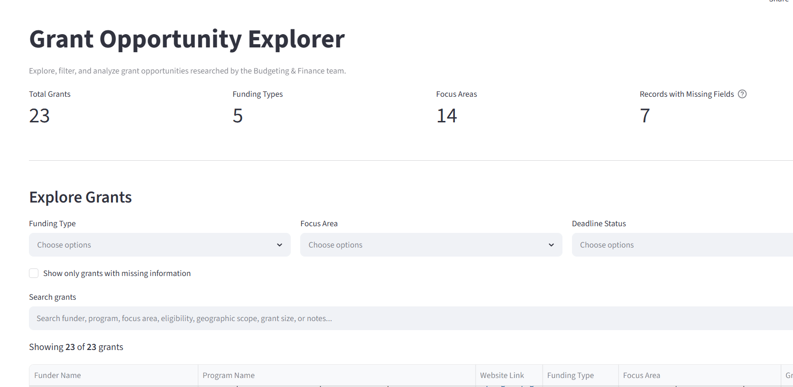
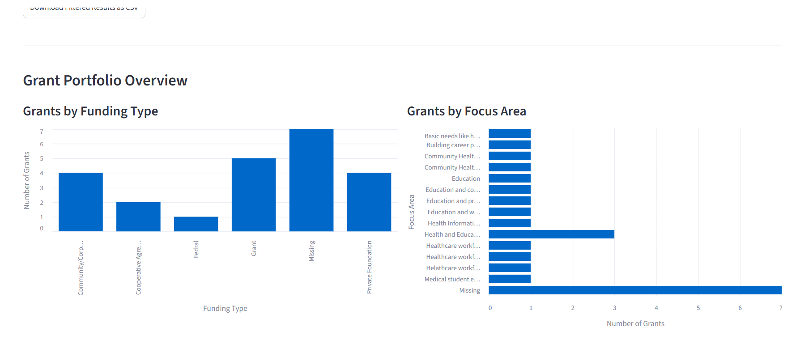

# Grant Opportunity Explorer

A Streamlit dashboard for exploring, filtering, and analyzing grant opportunities from publicly available funding sources.

**Live Demo**  
https://grant-opportunity-explorer.streamlit.app/

---

## Overview

This project was developed to organize and explore grant opportunities through an interactive dashboard. It provides searchable and filterable grant data, highlights missing information, and summarizes the overall grant portfolio with simple visualizations.

---

## Features

- Interactive filtering by funding type, focus area, and deadline status
- Keyword search across multiple grant fields
- Dashboard summary metrics
- Data quality indicators for missing information
- Portfolio overview charts
- Export filtered results as CSV

---

## Technologies

- Python
- Streamlit
- Pandas
- Plotly
- OpenPyXL

---

## Dataset

The dataset was compiled from publicly available grant opportunity sources for demonstration purposes.

Any organization-specific notes and internal evaluation fields have been removed.

---

## Screenshots

### Dashboard

### Portfolio Overview

